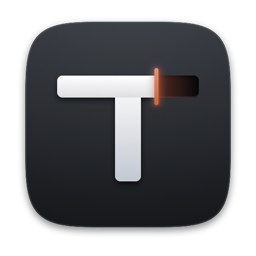
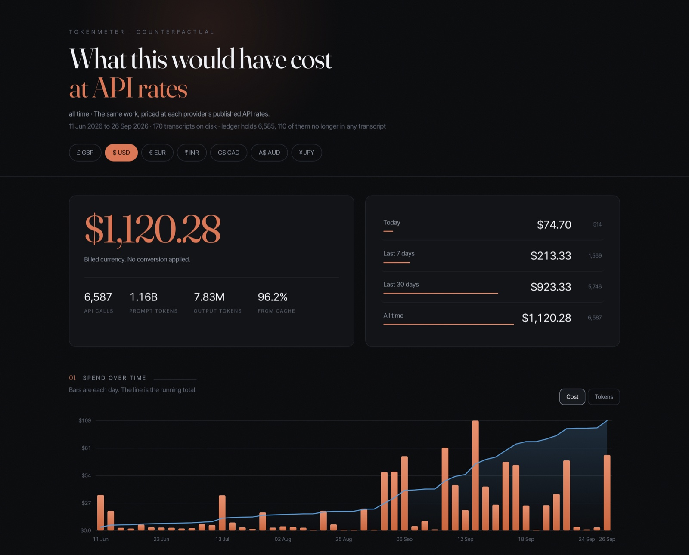
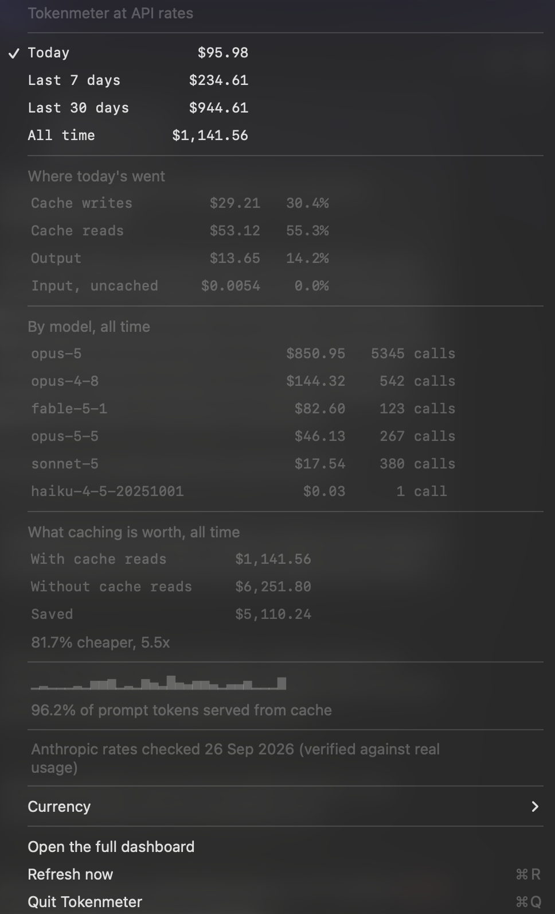
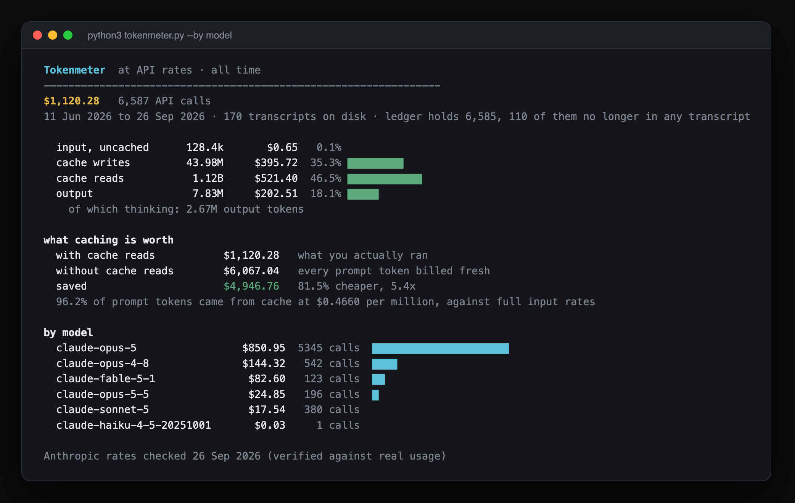
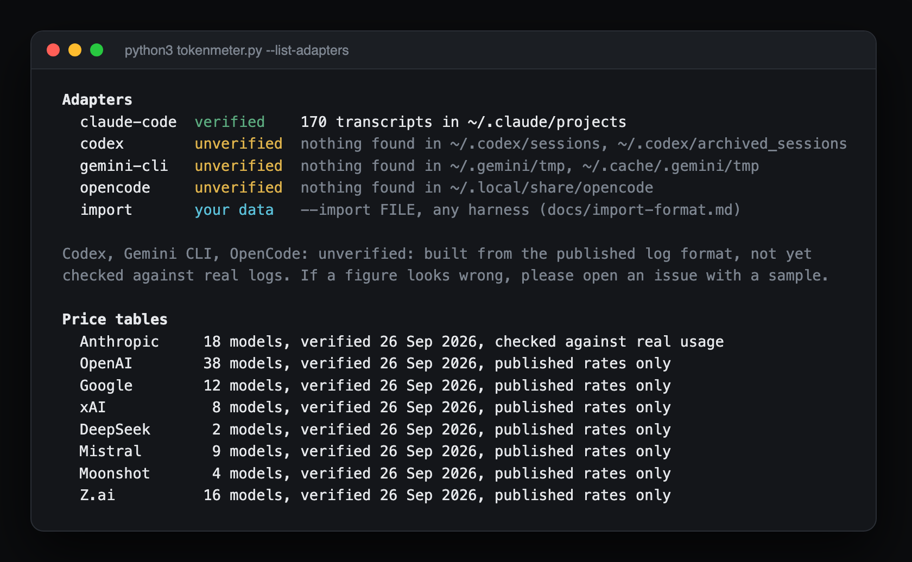
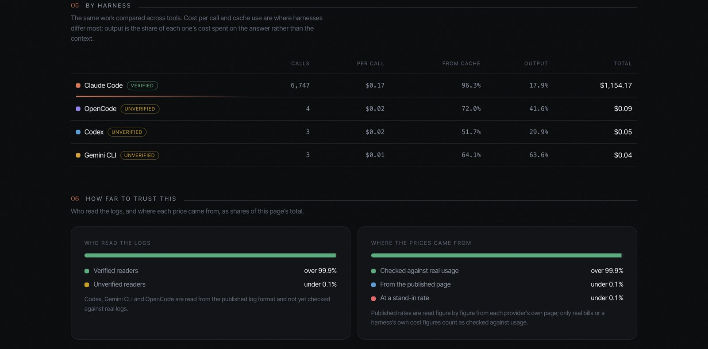
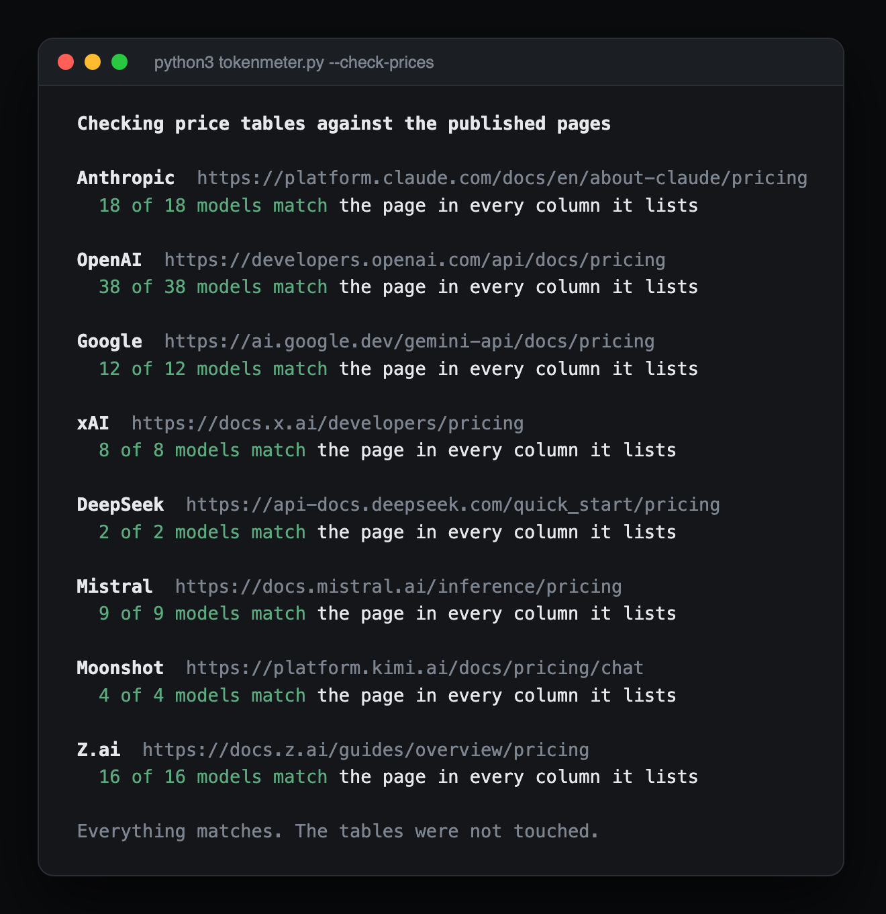
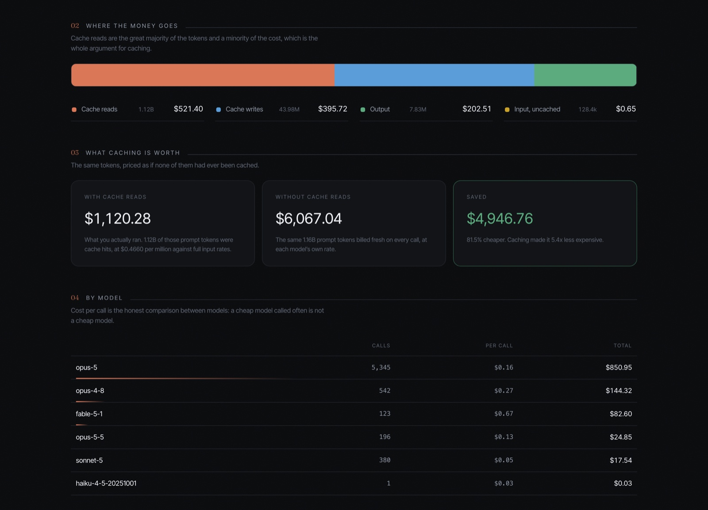

# Tokenmeter

What your AI coding would have cost at API rates.

On a subscription, a coding agent's usage is not billed per token, so you never see what it would cost. Tokenmeter reads the logs your harness already writes on your Mac and prices every API call at the provider's published rates. It is a counterfactual, not a bill, and nothing about your usage leaves the machine.



It has four faces over one engine:

| Face | What it is |
|---|---|
| Terminal report | The full breakdown, grouped however you like |
| Dashboard | One offline HTML page with charts, tables and a currency switcher |
| Menu bar app | The running figure, always visible, with four time windows |
| Claude Code status line and `/tokenmeter` command | This session's cost and today's, inside Claude Code |



## Requirements

- macOS 12 or later
- Python 3.9 or later (the one macOS ships is fine), no packages to install
- The Xcode command line tools, for the menu bar app: `xcode-select --install` (Homebrew installs them for you)

## Install

With [Homebrew](https://brew.sh):

```bash
brew tap adi-debug-source/tokenmeter https://github.com/Adi-debug-source/tokenmeter
brew install adi-debug-source/tokenmeter/tokenmeter
tokenmeter-setup
```

The formula lives in this repository, so the first line points Homebrew at it once. The second fetches Tokenmeter and adds the `tokenmeter` command. The third installs the menu bar app and, if you use Claude Code, the status line and the `/tokenmeter` command; Homebrew cannot write to your home folder itself, which is why it is a separate step. After `brew upgrade tokenmeter`, run `tokenmeter-setup` again.

Or from a clone:

```bash
git clone https://github.com/Adi-debug-source/tokenmeter.git
cd tokenmeter
./install.sh
```

Either way the same installer runs. It copies the engine to `~/.claude/tools/tokenmeter/`, builds the menu bar app into `~/Applications`, sets it to start at login, and, if you use Claude Code, adds the `/tokenmeter` command and the status line. If you already have a status line it is left alone; add `--statusline` to replace it, or `--no-app` to skip the menu bar app. From a clone, run `./install.sh` again after `git pull` to update.

To remove everything except your usage history: `tokenmeter-setup --uninstall` then `brew uninstall tokenmeter`, or `./install.sh --uninstall` from a clone. Files are moved to the Bin rather than deleted.

## Usage

With Homebrew the `tokenmeter` command is already there. From a clone, make it with:

```bash
alias tokenmeter="python3 ~/.claude/tools/tokenmeter/tokenmeter.py"
```

```bash
tokenmeter                      # everything found, all time
tokenmeter --by model           # or project, day, session, hour, weekday, source, provider
tokenmeter --since 30d          # a rolling window: 24h, 7d, 30d, 2026-09-01
tokenmeter --period lastmonth   # a calendar period: today, week, lastweek, month, lastmonth, year
tokenmeter --sessions           # the dearest sessions
tokenmeter --html               # the dashboard, written to ~/Downloads and opened
tokenmeter --currency GBP       # USD is the default; GBP, EUR, INR, CAD, AUD and JPY also work
tokenmeter --list-adapters      # which harnesses were found, and how far to trust each
tokenmeter --list-prices        # every model with a checked price, and its rates
tokenmeter --check-prices       # compare every price table with the provider's live page
tokenmeter --import FILE        # price usage from any other harness (see below)
tokenmeter --json               # machine readable
```



Every report says what window it covers, when each price table was last checked, and anything it had to estimate. Nothing is estimated quietly.

## Supported harnesses

Tokenmeter finds each harness's logs by itself. Each reader carries a verification status, and every report that uses an unverified one says so.

| Harness | Status | What it reads |
|---|---|---|
| Claude Code | **verified** | `~/.claude/projects` (or `$CLAUDE_CONFIG_DIR/projects`), subagents included |
| OpenAI Codex CLI | unverified | `~/.codex/sessions` and `archived_sessions` (or `$CODEX_HOME`) |
| Gemini CLI | unverified | `~/.gemini/tmp/*/chats` |
| OpenCode | unverified | `~/.local/share/opencode/opencode.db` |
| Anything else | your data | `--import FILE`, in the documented format |

**Verified** means checked against real logs and against the harness's own cost figures. Claude Code's figures match its own `total_cost_usd` to ten decimal places.

**Unverified** means built from the harness's published source code and tested against sample files made to that format, but not yet run against real logs. If you use one of these, please compare a figure against your own records and open an issue with a sample either way. One real sample is what it takes to promote an adapter to verified; see [adapters/README.md](adapters/README.md).



### Several at once

Use more than one harness, or one harness with models from several providers,
and every face adds what comparing them needs. With one of each, nothing
changes.

- **Dashboard:** a Harness menu beside the currencies shows any one harness on
  its own page. The spend chart splits each day by harness, models are grouped
  under the provider that priced them with the harnesses that used each, a
  By harness table compares cost per call and cache use, and "How far to
  trust this" shows how much of the total came from verified readers and
  from checked prices.
- **Menu bar:** By model stays the default; "Break down by" switches it to
  harnesses or providers.
- **Terminal:** `tokenmeter --by source` compares harnesses side by side.



### Any other harness

Cursor, Aider, Cline, a script of your own: if you can get at per-call token counts, write one JSON object per call and pass the file with `--import`:

```json
{"id": "resp_01", "timestamp": "2026-09-20T14:03:11Z", "provider": "openai", "model": "gpt-6-sol", "input": 1200, "cache_read": 8000, "output": 350}
```

The format, with a worked example for each provider's conventions, is in [docs/import-format.md](docs/import-format.md). Imported calls go into the ledger like any others, so importing the same file twice counts nothing twice, and they appear in every report, the dashboard and the menu bar.

## Which prices are confirmed

Every rate is in `pricing/`, one file per provider, each saying where its figures came from and when they were last checked. **Every model and its rates are listed in [docs/prices.md](docs/prices.md)**, generated from those files so the list cannot drift from what the tool actually charges.

There are three levels of confidence, and every report says which one each figure has:

1. **Confirmed against real usage.** Checked against the provider's published page *and* against real bills or the harness's own cost figures. Anthropic, all 18 models.
2. **Confirmed against the published page.** Read figure by figure from the provider's own pricing page, checked a second time independently, and pinned by a test; `--check-prices` re-confirms them against the live page at any time. Not yet compared with anyone's real bill. OpenAI, Google, xAI, DeepSeek, Mistral, Moonshot and Z.ai.
3. **Looked up online.** Any model not in the tables, priced at startup from the provider's page or LiteLLM's public list, and labelled as looked up wherever it appears. This is how Qwen and every other provider are priced.

| Provider | Models | Page checked | Against real bills |
|---|---|---|---|
| Anthropic | 18 | 26 Sep 2026 | **yes** |
| OpenAI | 38 | 26 Sep 2026 | not yet |
| Google (Gemini API) | 12 | 26 Sep 2026 | not yet |
| xAI | 8 | 26 Sep 2026 | not yet |
| DeepSeek | 2 | 26 Sep 2026 | not yet |
| Mistral | 9 | 26 Sep 2026 | not yet |
| Moonshot (Kimi) | 4 | 26 Sep 2026 | not yet |
| Z.ai (GLM) | 16 | 26 Sep 2026 | not yet |

The tables model what each provider publishes and a log can support: cached input rates, cache writes by lifetime, long-context surcharges above a threshold, fast or priority tiers, dated price changes (Gemini 3.6 to 3.8 Flash rise on 1 January 2027, and each call is priced at the rate on its own day), and DeepSeek's off-peak discount by time of day.

**A model the tables do not have is looked up online at startup,** once: first on the provider's own pricing page where Tokenmeter can read it, otherwise in [LiteLLM's public price list](https://github.com/BerriAI/litellm). The result is saved locally with its source and date, rechecked weekly, and labelled in every report as looked up, not checked by hand. Only price lists are downloaded; no usage data, totals or model names are sent anywhere except the one case of reading an OpenAI model's own page. `TOKENMETER_OFFLINE=1` or `--offline` switches it off, and an unknown model is then priced at a flagged stand-in rate.

## How accurate is this?

**Anthropic rates are verified.** Every rate in the table has been checked against Anthropic's published pricing, and spot-checked against Claude Code's own reported cost figures, which match to the cent. Claude Code is the author's daily driver, so these are the numbers that get used and noticed.

**Other providers are best-effort.** Their tables were read from each provider's own pricing pages, figure by figure, and `--check-prices` confirms they still match those pages. What has not been done is comparing them with a real bill from someone who uses those models daily. If you do, please check a month against your invoice and open an issue whether it matches or not.

**Checked prices do not update themselves.** The tables are hand-maintained and each carries the date it was last verified, shown in every report, with a warning once it is more than 90 days old. `tokenmeter --check-prices` fetches every provider's page and reports any difference, but never changes a table: a rate change is recorded as a new dated entry, so a call is always priced at the rate in force on the day it was made. The one thing that is fetched automatically is a price for a model no table has, and that is labelled wherever it is used. Exchange rates refresh automatically every 12 hours; prices do not.



**One known assumption:** Anthropic's 5-minute cache write multiplier (1.25x) is taken from the documentation and has not been measured, because Claude Code gives no way to force one. It carries roughly 3.6% of a typical total.

**Not modelled, by design:** batch and flex discounts (coding harnesses are interactive), regional or data-residency uplifts, cache storage fees billed by the hour, and search-grounding fees that depend on a monthly free allowance. Qwen has no table because its price depends on region, tier, thinking mode and cache type, which logs do not record; its models are priced by the online lookup and labelled.



## How it works

1. **Read.** One adapter per harness reads its logs and says what each API call was: model, provider, time, and tokens split into uncached input, cache reads, cache writes and output.
2. **De-duplicate.** Harnesses write the same response more than once: once per streamed content block, again when a session is resumed or forked. Tokenmeter keys every call by its response id and keeps the complete copy, which is the largest. Counting log lines instead overstates usage several times over.
3. **Price.** Each call is priced from its own provider's table at the rate in force that day.
4. **Remember.** Every priced call is written to a ledger, so history outlives the logs.

All the arithmetic lives in `tokenmeter.py`. The menu bar and status line only display what it computes.

### The ledger: an "all time" that lasts

Claude Code deletes transcripts after 30 days by default, and Codex compresses them after a week, so a tool that reads only logs has an "all time" that quietly shrinks. Tokenmeter keeps its own record, `~/.claude/cost-ledger.jsonl`, one line per call:

- **Tokens, never money.** A ledger of dollars would be frozen at the prices on the day it was written; a ledger of tokens reprices the whole history whenever a table changes.
- **Append only.** A row that supersedes an earlier one is appended, never edited, so the file is safe to keep in git and every diff is only the new lines.
- **Updated on every full read, never on a schedule.** The menu bar's 60-second refresh keeps it current.
- **Small.** About 220 bytes a call, a couple of megabytes a year.
- **Losing it degrades, it does not break.** Without it the tool falls back to the logs on disk.

```bash
tokenmeter --no-ledger          # price only what the logs hold
tokenmeter --ledger FILE        # use a different ledger
tokenmeter --rebuild-ledger     # rewrite it from the logs on disk (keeps the old one as .old)
```

### What "all time" means

Every API call in the logs on this Mac, plus every call the ledger remembers. Not your subscription, your account or when you installed anything; the tool knows none of those. The window it prints is the oldest and newest call it can see. Changing or pausing a plan changes nothing: everything is priced at public API rates, which is the point.

### Rolling windows and calendar periods

`--since` is rolling and always the same length, so `--since 30d` is comparable with the thirty days before it. `--period` is the calendar, which is what you want when checking against a bill: `lastmonth` is whichever month just ended. Weeks start on Monday. The menu bar uses rolling windows, because "this week" on a Monday morning is an hour long.

### What orchestration costs

A session that spawns subagents costs more because every subagent makes its own API calls. Tokenmeter reads subagent transcripts too, so that cost is counted. On one real history a quarter of all spend was subagents. `--by session` and the dashboard show where it went. Effort settings change how many tokens a model produces, never the price per token, so they need no special handling.

### Reading it next to Claude Code's Stats tab

The two answer different questions and will not match. The Stats tab counts every log line and adds cache reads into one headline token figure; Tokenmeter counts each API response once and prices the components separately. Cache reads are around 95% of prompt tokens and cost a tenth of the input rate, so a token total is a measure of text moved, not of money.

## Settings

| Variable | Does |
|---|---|
| `TOKENMETER_CURRENCY` | Default display currency everywhere (USD unless set) |
| `TOKENMETER_LEDGER` | Where the ledger lives |
| `TOKENMETER_CLAUDE_PROJECTS` | Extra Claude Code projects folders, colon separated, to count two Macs as one history |
| `TOKENMETER_OFFLINE` | `1` to never look prices up online |
| `CLAUDE_CONFIG_DIR`, `CODEX_HOME`, `XDG_DATA_HOME` | Respected, as each harness uses them |

The menu bar app is started by launchd and does not see your shell's variables; set them in `~/Library/LaunchAgents/io.github.adi-debug-source.tokenmeter.plist` under `EnvironmentVariables` if you need them there.

## Limitations

- **macOS only, today.** The engine is plain Python and needs one line changed (`open` becomes `xdg-open`) to run on Linux; the menu bar app is AppKit and would need a separate tray front end over the same `--summary-json`.
- **Only what is on this Mac.** Usage on a phone, in a browser, or on another machine leaves no local log and is not counted, unless you import it or point `TOKENMETER_CLAUDE_PROJECTS` at a copied folder.
- **Three of four harness readers are unverified,** as above.
- **Not a bill.** It prices what the logs record at public rates. Enterprise discounts, credits, taxes and failed requests are not in the logs.

## Contributing

- A new harness: [adapters/README.md](adapters/README.md)
- A new or changed price: [pricing/README.md](pricing/README.md)
- Before anything else: `python3 tests/test_tokenmeter.py` (standard library only, well under a second)
- How it is kept correct: [MAINTENANCE.md](MAINTENANCE.md)

## Licence

MIT, see [LICENSE](LICENSE). The dashboard embeds Fraunces and Inter Tight under the SIL Open Font License; see [fonts/README.md](fonts/README.md).

Tokenmeter is an independent project. It is not affiliated with, endorsed by, or connected to Anthropic, OpenAI, Google, xAI, DeepSeek, Mistral, Moonshot AI, Z.ai or any other provider it prices, and model and product names belong to their owners.
